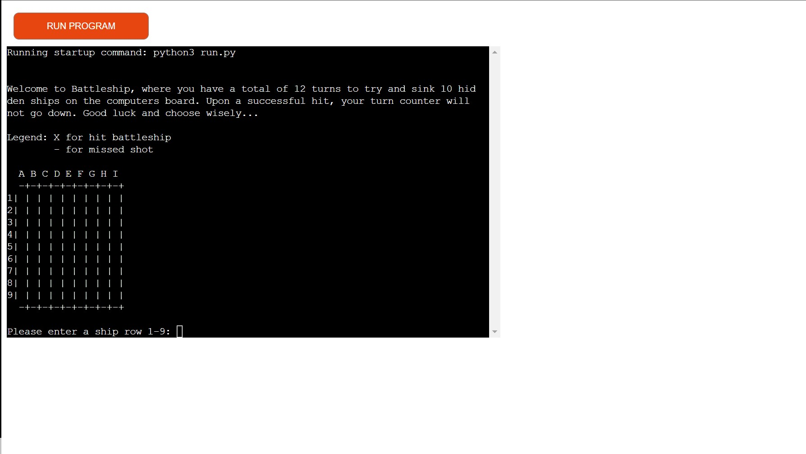
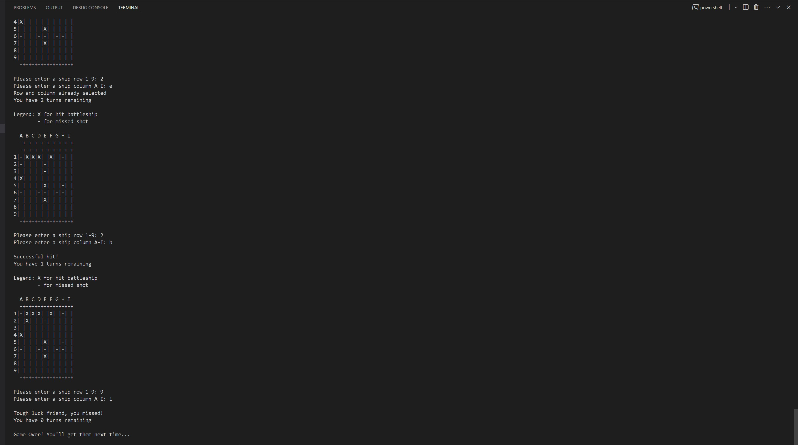

# Battleships

Battleships is a fully back-end Python based terminal game which runs exclusively in the Code Institute mock terminal on Heroku. 

## How to play

The rules of the game are fairly simple. It begins by asking the user to select a row within the range of 1-9. If the user happens to select a row outside of that range, or enter a key which is unrecognised, they will be given an error message and asked to type in a valid row.

Once a valid row is entered by the user, they are then instructed to enter a column rangiing from A to I. This has been programmed in a similar way where if the user enters an invalid column either outside of the range provided or any other key, an error message is displayed and the user is instructed to anter a valid column once more.

After both a valid row and column is entered by the user, a sign is displayed on the board depending on whether or not their guess was correct. If the user managed to successfully "hit" a ship, they are told their guess was correct, and an "X" is displayed on the board which corresponds with the row and column selected by the user. If their guess was incorrect, however, then a "-" is shown on the board, and they are told they missed.

The player has a total of 12 goes to try and sink 10 out of 40 hidden ships on the board. Once they run out of all 12, they are presented with a game over message and thr game ends. If the user successfully manages to guess the correct position of all 10 ships, however, then they are presented with an appropriate congratulatory message and told they have sunk all ships. Upon each successful hit that the user correctly guesses on the board, the turn counter does not decrease in order to reward the player and to make the game easier for the user to win.

## Table of Contents

* [**Requirements**](#requirements)
* [**Expectations**](#expectations)
* [**Features**](#features)
* [**Data Model**](#data-model)
* [**Technologies Used**](#technologies-used)
    + [Languages](#languages)
* [**Testing**](#testing)
* [**Deployment**](#deployment)
* [**Credits**](#credits)

## Requirements

* Ensure the game is responsive to the user as they enter their input
* The game should provide clear and easy to understand instructions on the rules and how to play
* User input validation
* A game over message once the user runs out of turns and fails to hit all the computer's ships
* A game won message which congratulates the user if they manage to hit all ships successfully

## Expectations

* As a user, I expect the layout of the board game to be organised and easy to understand
* I expect to be provided with clear instructions on how to play the game
* I expect the game to work as intended
* I expect the game to respond to my specific input correctly and appropriately
* I expect to be informed if I have entered an invalid key
* I expect to be informed if I have selected the same row and column as a previous attempt
* I expect the attempt counter to decrease with each attempt
* I expect both my misses and successful hits to be displayed on the board in a way that is easy to identify

[Back to Top](#table-of-contents)

## Features

### Existing Features

* Random board generation
- Generates random ships on the "hidden" board with each attempt
- Includes two boards named player board and hidden board, which stores the randomly allocated ships

* Play against the computer
* Accepts user input
* Input validation and error-checking
- The user is unable to enter an invalid row or column

- Cannot enter the same coordinates twice

- Game over screen

- Win game screen

[Back to Top](#table-of-contents)

## Data Model

I have decided to use predominantly two boards for my game. One board is the player board which the user sees as they play the game, while the other is a hidden board which only the computer sees and where all of the ships are located.

## Technologies Used

### Languages
* Python

## Testing

During the testing phase of my project, I ran into some issues, such as:

* Correctly structuring each of the functions that my game was going to follow in order. The way I decided to start my project is to layout all of the main functions that I know my game needed to include before writing the actual logic within each of those functions. I decided this method was the best way to structure my code as it helped me have a clear idea of each function that needed to be implemented for my project to work as intended. I had a few issues structuring my functions as I would sometimes misplace certain functions that needed to execute either after or before another.

I managed to resolve this issue by constantly testing as I wrote each line of code, and printing each line after it was written onto the terminal

* One big issue that had to be looked at was the number of boards that was going to be included in my game. I decided that it would be best to include two, one hidden, and the other a player board that the user would see and interact with during the game.

* A big part of my project for making this particular game is user input validation. It was essential that my game responded appropriately to any form of input from the users' end. It was important, first and foremost, that my game had clear and precise instructions that the user could understand when told to enter a specific input. For example, when I need the user to enter a specific row or column, I clearly displayed the range which the user must keep within when entering their selection, such as 1-9. My code had to include an if statement that would take into consideration each of the scenario that the game may be presented with based on the players' input. This was the most difficult part of the game, and I am proud that I managed to accomplish this in clear and concise code.

[Back to Top](#table-of-contents)

## Validator Testing

PEP8
- No errors were returned

## Deployment

This project was deployed using Code Institute's mock terminal for Heroku.

Steps for deployment:
* Fork or clone this repository
* Create a new Heroku app
* Set the buildbacks to Python and NodeJs in that order
* Link the Heroku app to the repository
* CLick Deploy

## Credits

* Code Institute for the deployment terminal
* [Antonio Rodriguez](https://github.com/AkaAnto)
* [Garrett Broughten](https://github.com/gbrough/battleship/blob/main/single_player.py)

[Back to Top](#table-of-contents)